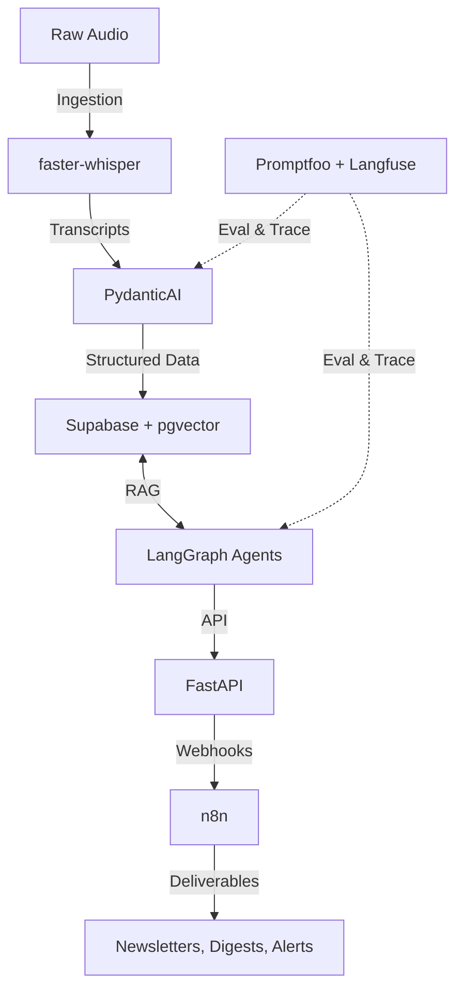

# Rádio Transforma — AI Content Intelligence Pipeline

A production-grade pipeline that transforms unstructured audio into a 
semantically searchable, reusable knowledge base — built with 
Eval-Driven Development as the first principle.

> **Status:** Phase 1 in progress — Ingestion phase active. Supabase client factory completed with 100% test coverage.

---

## 📊 Results

*Metrics will be published here as they are measured. No invented numbers — 
every value is reproducible from the eval harness in `/evals`.*

| Metric | Target | Current |
|---|---|---|
| Transcription accuracy (WER, PT-PT) | < 10% | *pending* |
| RAG context precision | > 0.85 | *pending* |
| RAG context recall | > 0.80 | *pending* |
| Agent latency (p95) | < 5s | *pending* |
| Cost per 1k queries | < \$1.00 | *pending* |

---

## 🎯 Business Context

**Rádio Transforma.pt** holds hundreds of hours of audio content — shows, 
interviews, political commentary — that is currently inaccessible for search, 
reuse, or editorial repurposing.

**The problem:** unstructured audio, no searchability, no reuse, manual 
editorial work.

**The solution:** an end-to-end pipeline that ingests audio, transcribes it 
(PT-PT), structures it semantically, stores it as a queryable knowledge base, 
and exposes it through tool-calling agents for content generation and research.

**The constraint:** the system must be *measurably correct* — not "looks 
good in a demo." Every component is evaluated against a golden dataset.

---

## 🏗️ Architecture

---

## 🔧 Engineering & Consulting Services

The architecture applied in this pipeline is designed to be highly modular and production-ready. If your organization requires custom AI infrastructure—specifically focusing on extracting structured value from unstructured data, mitigating hallucinations via Eval-Driven Development, or building stateful agentic workflows:

- Reach out via **[LinkedIn](https://www.linkedin.com/in/arthur-medeiros-conceição/)** or **[Email](mailto:amc.cultura.mkt@gmail.com)** to discuss your systems architecture and operational bottlenecks.
